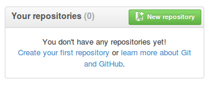
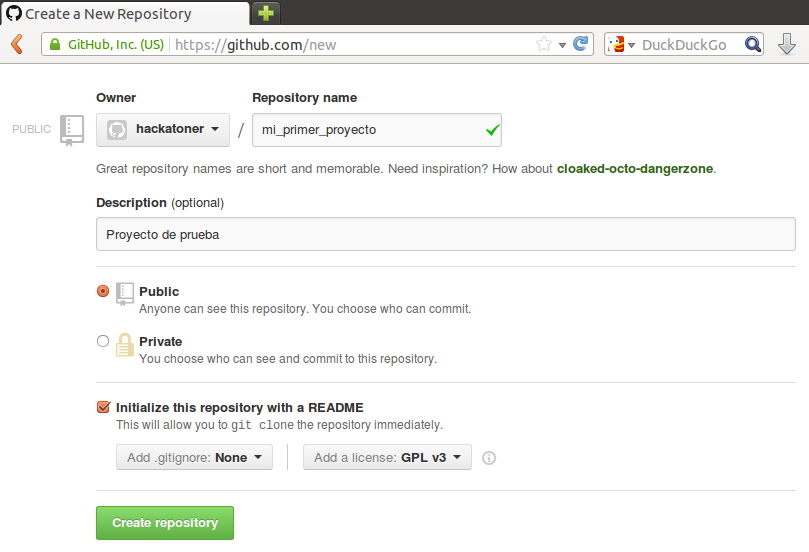
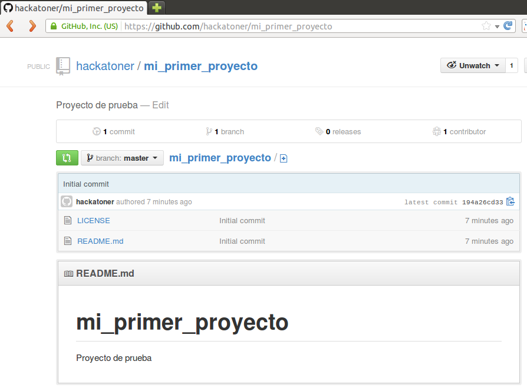
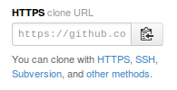

Cómo alojar tus aplicaciones en github
======================================

<a href='#tldr'>tl;dr</a> (está bien, ya conozco la teoría, quiero el <a href='#tldr'>resumen</a> ayuda-memoria)

Github como servidor de aplicaciones
------------------------------------

Github es un sitio web que te permite alojar el *código fuente* de tus aplicaciones, brindando además prestaciones propias de las redes sociales.

Si bien no provee un servicio de hosting completo, que te permita ejecutar código del lado del servidor (como podría ser una aplicación hecha con php, ruby o python, por ejemplo), Github cuenta con el servicio [Github pages](http://pages.github.com/) que te permite publicar páginas web estáticas, lo cual puede resultar útil para publicar documentación o el sitio de presentación de tu aplicación.

En los últimos tiempos han surgido una serie de aplicaciones desarrolladas con html, css y javascript y que simplemente se limitan a consumir servicios web desde el lado del cliente. Se trata de hecho de páginas estáticas que no necesitan ejecutar páginas desde el servidor, todo el procesamiento ocurre en el explorador web del usuario.

Si este es tu caso, puedes utilizar github para alojar las páginas de tu aplicación.

En el caso particular de open data, es común también en el caso de visualizaciones o aplicaciones similares, tomar los datasets, trabajar con ellos con diversas herramientas ([OpenRefine](http://openrefine.org/), [LibreOffice Calc](http://es.libreoffice.org/), Excel, [mysql](http://www.mysql.com/), [PostgreSQL](http://www.postgresql.org/)) y luego exponerlas a través de un web service ([fussion tables](http://www.google.com/drive/apps.html#fusiontables), [CartoDB](http://cartodb.com/)) o simplemente incluir la información en json en el código de tu aplicación.

En todos estos casos, tu aplicación podrá ser alojada en github.

Github Pages
------------

Pues bien, arrancaremos con un repositorio en github en donde tenemos una aplicación estática (html + css + js) que no requiere procesamiento del lado del servidor.

El proyecto es simplemente una aplicación que accede a una lista de contactos georreferenciada a través de un web service expuesto en [CartoDB](http://cartodb.com/) y lo muestra en un mapa utilizando la librería [LeafLet](http://leafletjs.com/).

El web service es de acceso público y pueden probarlo mediante la siguiente consulta: [http://devel.cartodb.com/api/v2/sql?q=select * from my_contacts](http://devel.cartodb.com/api/v2/sql?q=select * from my_contacts)

La aplicación consiste en arhivos html, css y js, ya que no requiere ningún procesamiento del lado del servidor.

Gracias a esto es que podemos usar [GitHub Pages](http://pages.github.com/) para alojarla.

https://help.github.com/articles/creating-project-pages-manually

Lo primero que haremos será habilitar GitHub Pages. Para ello tenemos que crear una *rama* de git que se llame gh-pages, y ahí pondremos el contenido que querramos que GitHub publique.

```
$ git clone https://github.com/hackatoner/hosting.git
Clonar en «hosting»...
remote: Counting objects: 14, done.
remote: Compressing objects: 100% (13/13), done.
remote: Total 14 (delta 1), reused 10 (delta 1)
Unpacking objects: 100% (14/14), done.
```

Luego creamos una rama *huérfana* llamada *gh-pages*

```
$ git checkout --orphan gh-pages
Switched to a new branch 'gh-pages'
```

Y guardamos los cambios

```
hackatoner@station:~/proyectos/hosting$ git commit -m 'creamos la rama gh-pages'
[gh-pages (root-commit) 1ee8dd4] creamos la rama gh-pages
 8 files changed, 901 insertions(+)
 create mode 100644 LICENSE
 create mode 100644 README.md
 create mode 100644 index.html
 create mode 100644 js/bootstrap.min.js
 create mode 100644 js/cartodbData.js
 create mode 100644 js/leaflet.css.min.js
 create mode 100644 js/leaflet.sprite.js
 create mode 100644 js/leaflet.sprite.min.js
```

Finalmente, actualizamos el repositorio remoto de GitHub y configuramos nuestra rama local gh-pages para que siga la rama gh-pages de GitHub:

```
hackatoner@station:~/proyectos/hosting$ git push --set-upstream origin gh-pages
Username for 'https://github.com': hackatoner
Password for 'https://hackatoner@github.com':
Counting objects: 11, done.
Compressing objects: 100% (11/11), done.
Writing objects: 100% (11/11), 70.81 KiB, done.
Total 11 (delta 1), reused 0 (delta 0)
To https://github.com/hackatoner/hosting.git
 * [new branch]      gh-pages -> gh-pages
Branch gh-pages set up to track remote branch gh-pages from origin.
```

Si visitamos nuestro repositorio en GitHub, y hacemos click en *Settings*, veremos que GitHub recibió la nueva rama *gh-pages* y nos avisa que en 10 minutos estará disponible:


Luego de unos instantes, podremos visitar http://hackatoner.github.io/hosting y veremos nuestra aplicación en acción:


---

Si te interesa la aplicación aquí hay una [serie de artículos](http://opensas.wordpress.com/2013/06/27/journey-to-the-open-data-jungle-with-openrefine-cartodb-leaflet-and-javascript/) en la que explico paso a paso como desarrollarla:

[Trabajando con OpenRefine](http://opensas.wordpress.com/2013/06/27/journey-to-the-open-data-jungle-with-openrefine-cartodb-leaflet-and-javascript/)

[Georreferenciando información con OpenRefine y OpenStreetMap](http://opensas.wordpress.com/2013/06/30/using-openrefine-to-geocode-your-data-using-google-and-openstreetmap-api/)

[Publicando tu información en un web service con CartoDB](http://opensas.wordpress.com/2013/07/06/publish-your-own-geocoded-web-services-with-cartodb/)


Normalmente uno tendrá en GitHub el código fuente de su aplicación, y además querrá tener un sitio web estático para publicar al documentación o novedades acerca del proyecto.

A tales efectos tendremos que crear una *rama* llamada *gh-pages*, y GitHub simplemente publicará el contenido de esa rama.

En nuestro caso, nosotros queremos que en esa rama figure la propia aplicación, es decir, queremos publicar efectivamente el código fuente.


https://help.github.com/articles/creating-project-pages-manually


---


A la hora de desarrollar una aplicación, un sitio web o una visualización, vamos generando distintos archivos (código fuente, html, documentación, planillas, hojas de estilo, gráficos, etc.) que son los que conformarán nuestro proyecto.

A medida que estos proyectos se vuelven más complejos se torna indispensable poder llevar el control de los cambios que efectuamos, en especial cuando trabajamos en equipo y debemos recibir y gestionar contribuciones de terceros.

Para eso surgieron los <a href='http://es.wikipedia.org/wiki/Control_de_versiones'>sistemas de control de versiones</a>, que nos permiten almacenar los archivos que queremos gestionar, actualizarlos y llevar el registro histórico de las acciones efectuadas sobre cada elemento.

Git
---

<a href='http://git-scm.com/'></a>

Uno de los sistemas de control de versiones que últimamente ha cobrado gran popularidad es <a href='http://es.wikipedia.org/wiki/Git'>Git</a>. Fue creado por <a href='http://es.wikipedia.org/wiki/Linus_Torvalds'>Linus Torvalds</a> en 2005, para gestionar el código fuente del <a href='http://es.wikipedia.org/wiki/Linux_(núcleo)'>núcleo del sistema operativo Linux</a>. Git es además <a href='http://es.wikipedia.org/wiki/Software_libre'>software libre</a> publicado bajo la licencia <a href='https://gnu.org/licenses/old-licenses/lgpl-2.0.html'>GPL v2</a>.

A diferencia de otros sistemas de control de versiones que cuentan con un repositorio central al cual hay que conectarse para obtener o enviar nuevas versiones, git es un sistema distribuido. Esto significa que cada repositorio de git contiene todo el historial del proyecto y es completamente autónomo e independiente de cualquier otro repositorio central o acceso a la red.

Para más información acerca de Git puedes consultar <a href='http://git-scm.com/'>su sitio web</a>, en el cual encontrarás también el libro <a href='http://git-scm.com/book'>Pro Git</a> completo en castellano.

Github
------

<a href='https://github.com/'></a>

Github es un servicio web que te permite alojar el código fuente de tus proyectos, utilizando git como sistema de control de versiones. Pero la principal característica de Github es que provee una plataforma social para el desarrollo de aplicaciones, permitiéndote publicar tus proyectos, seguir aquéllos que te interesan, colaborar con proyectos existentes y toda una serie de servicios sumamente útiles para trabajar de manera colaborativa.

Muchos lo describen como *el Facebook de los desarrolladores*, pero últimamente su uso alcanza a otras profesiones, y hacia principios de 2013 ya contaba con más de tres millones de usuarios y más de cinco millones de repositorios (<a href='https://en.wikipedia.org/wiki/GitHub#cite_ref-27'>ver cita</a>).

Manos a la obra
===============

Instalando git
--------------

Lo primero que debemos hacer es <a href='http://git-scm.com/book/es/Empezando-Instalando-Git#Instalando-en-Linux'>instalar git</a> en nuestras estaciones de trabajo.

Si estás utilizando Ubuntu (o cualquier otra distribución basada en Debian) sólo tienes que abrir una ventana de comandos, y ejecutar la siguiente orden:

```
$ sudo apt-get install git
```

Si estás usando Fedora (o cualquier otra distribución que use paquetes rpm) deberás abrir una ventana de comandos e ingresar:

```
$ yum install git-core
```

Para verificar que git se instaló correctamente ingresa el siguiente comando:

```
$ git --version
git version 1.8.1.2
```

Luego deberás [configurar git](http://git-scm.com/book/es/Empezando-Configurando-Git-por-primera-vez). Ingresa los siguientes comandos para configurar tu nombre de usuario y dirección de correo electrónico.

```
$ git config --global user.name "mi nombre de usuario"
$ git config --global user.email mi_mail@ejemplo.com
```

Esto es importante ya que cada vez que confirmes un cambio (commit) esta información será almacenada por git para tener registro de qué persona hizo cada cambio. A su vez, github utiliza esta cuenta de correo para asociar cada cambio con tu cuenta de github, así que tenés que configurar la misma cuenta de correo que vayas a utilizar para registrar tu cuenta en github.

Para este tutorial utilizaremos el usuario *hackatoner* y la cuenta de mail *hackatoner.programar@gmail.com*


También podés incluir esta configuración para que git te muestre la salida en pantalla utilizando colores:

```
$ git config --global color.ui true
```

Nota: También incluiremos esta configuración para evitar un mensaje bastante molesto que git emite y para que tenga un comportamiento más conservador a la hora de actualizar ramas remotas. Para más información podés consultar <a href='http://stackoverflow.com/a/13148313/47633'>esta respuesta</a> en <a href='http://stackoverflow.com'>stackoverflow</a>.

```
$ git config --global push.default simple
```

Registrar una cuenta en github
------------------------------

Ahora deberás registrar una cuenta en github. Para ello, navegá a https://github.com, ingresá tu nombre de usuario, dirección de correo y una clave, y luego hacé click en *Sign up for GitHub*.


En nuestro caso elegiremos como nombre *hackatoner*, y nuestra dirección de correo será *hackatoner.programar@gmail.com*.

Luego de registrar nuestra cuenta veremos la pantalla principal de github.


Creando nuestro primer proyecto
-------------------------------

Abajo a la derecha, veremos que todavía no contamos con ningún repositorio. Vamos a crear nuestro primer proyecto.



Hacemos click en 'New repository' y completamos la información de nuestro proyecto.



Deberemos ingresar un nombre, una descripción y elegir una licencia. También es buena idea inicializar nuestro repositorio con un archivo *README* (Léame) en el cual expliquemos de qué se trata el proyecto.

Luego hacemos click en *Create repository*. Veremos que github ha creado el proyecto con la licencia que le especificamos y un archivo léame con el comentario que ingresamos



Github también ha creado para nosotros un url: https://github.com/hackatoner/mi_primer_proyecto. Esta es la dirección de nuestro proyecto en github, y a través de ella el resto del mundo puede ver nuestro proyecto, seguirlo, controlar nuestros avances, copiárselo localmente para mejorarlo, y colaborar con nosotros.

Clonando localmente nuestro repositorio
---------------------------------------

Para poder trabajar en nuestro proyecto debemos disponer de los archivos localmente en nuestro equipo. Por eso lo que haremos será copiarnos (clonar en la jerga de git) el repositorio entero, junto con su historial de cambios) en nuestra estación de trabajo.

Para clonar localmente nuestro repositorio debemos copiar la dirección que se encuentra en la parte inferior derecha de la página de nuestro proyecto:



En nuestro caso el url para clonar nuestro flamante repositorio es: https://github.com/hackatoner/mi_primer_proyecto.git

> Hay otros métodos para comunicarte con repositorios de github. En <a href='https://help.github.com/articles/generating-ssh-keys'>este artículo</a> puedes ver cómo establecer una conexion segura con github utilizando SSH, para ello deberás crear un par de claves pública-privada, agregar tu clave pública a github y luego podrás usar el url de la forma git@github.com:hackatoner/mi_primer_proyecto.git.

Ahora tendremos que abrir una consola, y decirle a git que clone este repositorio:

```
$ git clone https://github.com/hackatoner/mi_primer_proyecto.git
```

En nuestro caso creamos un directorio *proyectos* en nuestro directorio de usuario. Vemos como git creó a su vez un directorio *mi_primer_proyecto* y trajo además los archivos del mismo.


Flujo de trabajo con git
------------------------

Es importante entender <a href='http://git-scm.com/book/es/Fundamentos-de-Git-Guardando-cambios-en-el-repositorio'>el flujo de trabajo con git</a>. La principal diferencia con otros sistemas de control de versiones, es que los archivos que tienen cambios no son automáticamente confirmados al hacer un commit, sino que hay que agregarlos manualmente para ser grabados (pasarlos al área de stage). Esto nos permite tener mayor control y granularidad a la hora de grabar nuestros cambios.

Los archivos en un repositorio de git pueden estar bajo los siguientes estados:


-  *Sin seguimiento (untracked)*

    Git ignora estos archivos

-  *Bajo seguimiento, sin modificaciones (tracked, unmodified)*

    Git está al tanto de estos archivos, pero los mismos fueron modificados desde el último commit.

-  *Bajo seguimiento, con modificaciones (tracked, modified)*

    El archivo está en git, pero contiene cambios de los cuales git no está al tanto. Estos cambios NO serán incluidos en el próximo commit.

-  *Bajo seguimiento, preparado (tracked, staged)*

    Los cambios de estos archivos serán incluidos en el próximo commit. En la jerga de git se dice que estos archivos están en el área de stage (staging area)

El flujo sería el siguiente:

Cuando clonamos un repositorio todos los archivos estarán inicialmente bajo seguimiento de control (tracked).

Al agregar nuevos archivos deberemos ponerlos bajo seguimiento con el comando (tracked) ```git add```, con lo cual también pasará a estado preparado (staged)

Al modificar un archivo que ya estaba bajo seguimiento , también mediante el comando ```git add``` haremos que pase de estado con modificaciones a preparado (staged)

Finalmente, para confirmar los cambios de los archivos preparados (staged) ejecutaremos el comando 'git commit', con lo cual las modificaciones se grabarán en el repositorio, se creará un nuevo commit, y los archivos volverán a estado sin modificaciones (unmodified).

Vamos a verlo con un ejemplo práctico. Mediante el comando ```git status``` podemos ver el estado de los archivos en nuestro directorio de trabajo.

```
$ git status
# En la rama master
nothing to commit, working directory clean
```

Lo que haremos a continuación es editar localmente el archivo README.md. Podés utilizar cualquier editor de texto, en nuestro caso utilizaremos gedit.

```
$ cd mi_primer_proyecto
$ gedit README.md

mi_primer_proyecto
==================

Este es un proyecto de prueba para aprender a utilizar git y github.
```

También agregaremos un archivo html.

```
$ gedit index.html

<html>
  <body>
    <h1>Bienvenido a mi primer proyecto</h1>
  </body>
</html>
```

Veamos ahora qué nos retorna el comando ```git status```:

```
$ git status
# En la rama master
# Cambios no preparados para el commit:
#   (use «git add <archivo>...» para actualizar lo que se ejecutará)
#   (use «git checkout -- <archivo>...« para descartar cambios en le directorio de trabajo)
#
# modificado:   README.md
#
# Archivos sin seguimiento:
#   (use «git add <archivo>...» para incluir lo que se ha de ejecutar)
#
# index.html
no hay cambios agregados al commit (use «git add» o «git commit -a»)
```

Aquí podemos ver que el archivo README.md está modificado (modified) pero no está preparado (staged) para ser confirmado. También vemos que el archivo index.html está sin seguimiento.

Mediante el comando ```git add``` indicaremos qué archivos queremos preparar (stage) para ser grabados en el próximo commit.

```
$ git add README.md
$ git status
# En la rama master
# Cambios para hacer commit:
#   (use «git reset HEAD <archivo>...«para eliminar stage)
#
# modificado:   README.md
#
# Archivos sin seguimiento:
#   (use «git add <archivo>...» para incluir lo que se ha de ejecutar)
#
# index.html
```

Ahora vemos que el archivo README.md está listo para ser confirmado. Para grabarlo (commit) utilizaremos el comando ```git commit```. Cada vez que hagamos un commit debemos incluir un mensaje mediante el parámetro -m, de la siguiente manera:

```
$ git commit -m 'completamos el archivo README.md'
[master 981d17b] completamos el archivo README.md
 1 file changed, 1 insertion(+), 1 deletion(-)

$ git status
# En la rama master
# Su rama está delante de «origin/master« para 1 commit.
#   (use "git push" to publish your local commits)
#
# Archivos sin seguimiento:
#   (use «git add <archivo>...» para incluir lo que se ha de ejecutar)
#
# index.html
no se ha agregado nada al commit pero existen archivos sin seguimiento (use «git add» para darle seguimiento)
```

De la misma manera, preparamos (stage) y confirmamos (commit) el archivo index.html:

```
$ git add index.html

$ git commit -m 'creamos pagina html de bienvenida'
[master d6d9019] creamos pagina html de bienvenida
 1 file changed, 5 insertions(+)
 create mode 100644 index.html
hackatoner@station:~/proyectos/mi_primer_proyecto$ git status
# En la rama master
# Su rama está delante de «origin/master« para 2 commits.
#   (use "git push" to publish your local commits)
#
nothing to commit, working directory clean
```

Vemos que git nos indica que nuestra rama de trabajo está dos commits por delante de origin/master. Cada vez que clonamos un repositorio, creamos un nuevo repositorio que tiene a su vez una referencia al repositorio original. Esto lo podemos comprobar mediante el siguiente comando:

```
$ git remote -v
origin  https://github.com/hackatoner/mi_primer_proyecto.git (fetch)
origin  https://github.com/hackatoner/mi_primer_proyecto.git (push)
```

Lo que tenemos que hacer ahora es enviar los cambios que acabamos de confirmar (commit) en nuestro repositorio local a nuestro repositorio remoto en github. Haremos esto mediante el comando ```git push```.

> Debido a que estamos utilizando el url https, git nos pedirá nuestro nombre de usuario y password de github.

```
$ git push
Username for 'https://github.com': hackatoner
Password for 'https://hackatoner@github.com': xxxxxx

Counting objects: 8, done.
Compressing objects: 100% (6/6), done.
Writing objects: 100% (6/6), 670 bytes, done.
Total 6 (delta 1), reused 0 (delta 0)
To https://github.com/hackatoner/mi_primer_proyecto.git
   194a26c..d6d9019  master -> master
```

Si volvemos a nuestro sitio en github, veremos que se ha agregado el archivo index.html y que el archivo README.md fue modificado


Además, si hacemos clicks en *commits* podemos ver la lista de commits:


Y haciendo click en cada uno de ellos podemos ver el detalle de los cambios efectuados y quién fue el usuario que los hizo:


Manteniendo nuestro repositorio local actualizado
-------------------------------------------------

A veces pasará que nuestro repositorio remoto de github está más actualizado que nuestro repositorio local. Esto puede ocurrir cuando utilizamos otra máquina para desarrollar, o cuando hay más de una persona trabajando sobre el mismo repositorio.

Para ello utilizamos el comando ```git pull``` para traernos los últimos cambios del repositorio remoto en github a nuestro repositorio local en nuestra estación de trabajo.

```
$ git pull
remote: Counting objects: 5, done.
remote: Compressing objects: 100% (3/3), done.
remote: Total 3 (delta 0), reused 0 (delta 0)
Unpacking objects: 100% (3/3), done.
De https://github.com/hackatoner/mi_primer_proyecto
   d6d9019..8f9e950  master     -> origin/master
Updating d6d9019..8f9e950
Fast-forward
 README.md | 2 ++
 1 file changed, 2 insertions(+)
```

En este caso, git nos dice que el archivo README.md fue actualizado.

> En este artículo hemos trabajado exclusivamente desde la línea de comandos, sin embargo existen varias [herramientas visuales](http://git-scm.com/downloads/guis) que nos facilitan la tarea (una muy recomendable es <a href='http://www.syntevo.com/smartgithg/'>SmartGit</a>). Sin embargo, es recomendable trabajar un buen tiempo desde la línea de comandos para aprender bien los conceptos básicos antes de adoptar una herramienta visual.

Conclusión
==========

La combinación de git más github nos brinda herramientas sumamente poderosas para gestionar archivos y trabajar colaborativamente.

En este artículo apenas hemos visto lo mínimo indispensable como para poder iniciar un proyecto en github. Git es un tema muy vasto como para ver en un solo artículo, y github provee muchos servicios más de suma utilidad.

Para más información no dejen de leer el libro <a href='http://git-scm.com/book/es/'>Pro Git</a> que se encuentra disponible en castellano, en el sitio de git. Además, cualquier duda que tengan acerca de git seguramente estará preguntada y contestada en <a href='http://stackoverflow.com/'>stackoverflow</a>.

Por último, les dejamos un resumen ayuda-memoria para los más ansiosos, con algunos comandos extra:

-------------

<a name='tldr'><h2>Resumen para ansiosos</h2></a>

*Instalar git*

En distros basadas en debian:

```
sudo apt-get install git
```

En distros basadas en rpm:

```
yum install git-core
```

*Configurar git*

```
$ git config --global user.name "mi nombre de usuario"
$ git config --global user.email mi_mail@ejemplo.com
$ git config --global color.ui true
$ git config --global push.default simple
```

*Registrar una cuenta en github*

Navegá a navegá a <a href='https://github.com/'>https://github.com</a> y completá la información

*Crear un nuevo repositorio*

Ingresá a github con tu cuenta, hacé click en 'Repositories' y luego 'New', o simplemente navegá a <a href='https://github.com/new'>https://github.com/new</a>.

*Clonarte el repositorio localmente*

```
git clone https://github.com/mi_usuario/mi_proyecto.git
```

*Consultar el estado de los archivos*

```
git status
```

*Agregar archivos para ser confirmados (stage)*

```
git add <archivo>
```

*Ver las diferencias entre los archivos preparados (staged) y no preparados (unstaged)*

```
git diff
```

*Ver las diferencias entre los archivos preparados (staged) y los confirmados (commited)*

```
git diff --cached
```

*Ver el historial de los commits*

```
git log
```

*Confirmar (commit) archivos*

```
git commit -m 'mensaje del commit'
```

*Corregir el último commit*

```
git commit --amend -m "nuevo mensaje corregido"
```

*Undo: Sacar de stage el archivo y pasarlo a modified (unstage)*

```
git reset HEAD mi_archivo.txt
```

*Undo: Deshacer los cambios del archivo y volver a la versión del repositorio*

```
git checkout mi_archivo.txt
```

*Enviar los cambios de mi repositorio local al repositorio remoto en github*

```
git push
```

*Actualizar mi repositorio local con los cambios del repositorio de github*

```
git pull
```

----

Material de referecia:

[Libro Pro Git en castellano](http://git-scm.com/book/es/)

-   [Instalando git](http://git-scm.com/book/es/Empezando-Instalando-Git#Instalando-en-Linux)

-   [Configurando git](http://git-scm.com/book/es/Empezando-Configurando-Git-por-primera-vez)

-   [Guardando cambios en el repositorio](http://git-scm.com/book/es/Fundamentos-de-Git-Guardando-cambios-en-el-repositorio)

---

[Tutorial de Git en inglés](http://nyuccl.org/pages/GitTutorial/)

[Machete ayuda-memoria con los comandos más comunes](http://www.git-tower.com/files/cheatsheet/Git_Cheat_Sheet_grey.pdf)

[Tutorial en Castellano](http://www.ptydev.com/tutoriales/tutorial-basico-de-git)
